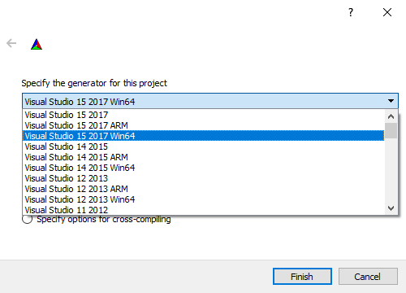

# Compiling

## Generate a project with CMake

The instructions below are largely consistent between Windows, Linux and MacOS. Once the generation is completed, you can follow the platform-specific instructions to compile the project itself.

### The CMake gui 

Once you've [installed CMake](http://www.cmake.org/download), run it and you'll see a screen something like the image below. You'll learn to be pretty familiar with this screen!

The two boxes at the top let you specify the location of your source code and the location to put build files. You should fill them in - the source location is just your regular T3D directory, and the binaries location is where you want your Visual Studio solutions to go. This should probably be something like the image below.

### Configuration 

Once you've set your paths, you're ready to configure your project! Hit the 'configure' button in the bottom left, and you'll be asked to choose the generator for this project. CMake lets you create project files for many different compilers. Most Windows users will be using some form of Visual Studio, so go ahead and select the version appropriate to you, like in the image below.

Once you've chosen that, you'll be presented with an error message! This is CMake prompting you to enter a name for your project, though unfortunately the only way we have to implement this is by throwing an error!

Don't panic - just hit OK, and expand the 'uncategorized entries' section and edit the value of TORQUE\_APP\_NAME to match the project name you're working on. At this point you can also specify whether the generated projects should use relative paths. We always recommend doing this.

Once you've filled on those values, hit 'configure' again, and you should be presented with teo more categories - TORQUE and CMAKE. Go ahead and expand TORQUE and browse the options available. You shouldn't need to touch most of these unless you have special needs - for example, PhysX, Bullet, Recast navigation or Oculus Rift support.

Once you're happy with your choices, click 'generate' and CMake will output project files to the directory you chose.

### The generated files 

If you browse to the location you asked CMake to put your binaries, you'll see a bunch of projects and solution files named after your project, depending on your platform.

&#x20;

## Compiling the project


[compiling-in-windows.md](compiling/compiling-in-windows.md)



[compiling-in-linux.md](compiling/compiling-in-linux.md)



[compiling-in-macos.md](compiling/compiling-in-macos.md)

