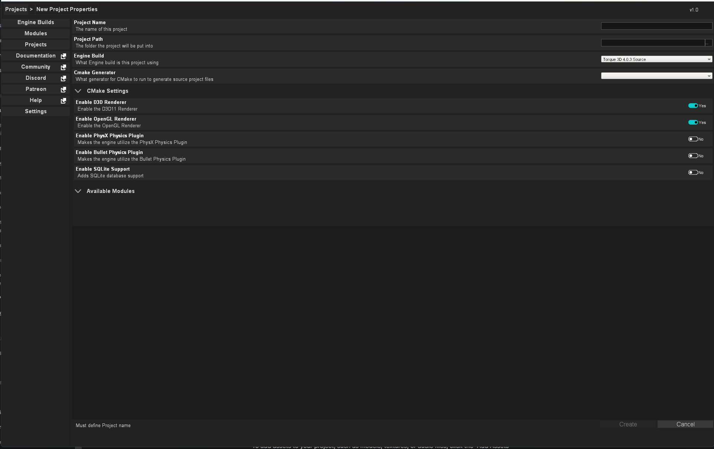

# Creating a Project With the Project Manager

Torque Project Manager (TPM or PM) is a user-friendly application that makes it easy to create and manage projects for the Torque3D game engine. With TPM, you can quickly set up new projects, manage your assets, and launch your game directly from the application. In this article, we will guide you through the process of setting up and using TPM to manage your Torque3D projects.

### Download and Install Torque Project Manager

The first step is to download and install the latest version of Torque Project Manager. You can find the download link on the official repository: [https://github.com/TorqueGameEngines/ProjectManager/releases](https://github.com/TorqueGameEngines/ProjectManager/releases). Make sure to select the version that is compatible with your operating system.

### Launch Torque Project Manager

After downloading and copying the TPM to your machine, launch the application via the TorqueManager executable file. This will open the main TPM window.

.png>)

### Setting up an Engine Build

To create a Torque3D Project, first you need a copy of the engine to work with. the TPM will download a copy of the engine to your machine, then when you create a new project, will duplicate the engine build copy for the new project. This keeps the engine build a clean template separate from any project-specific changes you may make on the project itself.

By default, the TPM will download Engine Builds and Assets in folders alongside the TorqueManager executable, but you can change where this content is downloaded to in the Settings page.

To download an Engine Build, simply select one listed in the 'Available for Download' section. It will by default list the latest release of Torque3D, both the precompiled binary as well as uncompiled source build. It will also list the uncompiled latest development branch if you want to work with the bleeding edge.

For the purposes of this article, we'll be focusing on the uncompiled source build.

You can tell a uncompiled source build by the 'Source' tag.

Once you've clicked, it, you'll go to the page for this build. Click the "Download" button at the top

.png>)

It will download the engine build via git to your machine. You'll likely see a terminal window appear. This is normal. It will run through the download process until it is completed.

### Create a New Project

To create a new project, you can either select an Engine Build, and click the 'New Project' button at the top:

.png>)

Or you can click the "Projects" button the left side, and then click the "Create New" button at the top.

This will bring up the new project's properties page where you can enter the project details, such as the name, description, and location.

After entering the project details, click the "Create" button to create the project. TPM will automatically create a new project folder with the necessary files and directories. This may take a few minutes to copy everything.

Once the copy is done, by default the settings of the TPM are set to attempt to automatically build the project via command line make invoke. Once that is completed, your executable will be ready to go.&#x20;

To work on the actual code of your project, you can open the project file in the OS's preferred application (ie, \*.sln opens in Visual Studio, \*.xcodeproj opens in XCode) by clicking the "Open Solution" button:

.png>)

To regenerate the CMake of the project, simply click the "Regen Project" button:

.png>)
